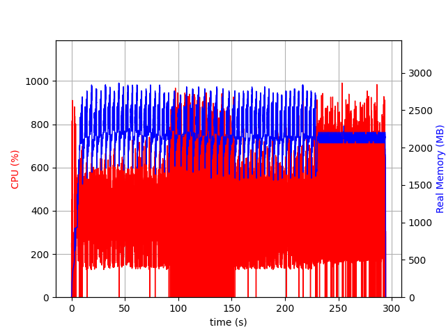
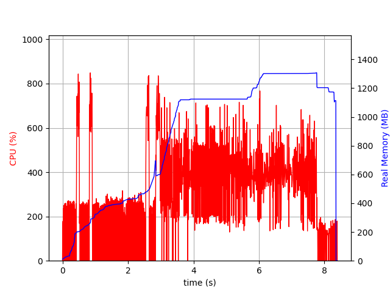
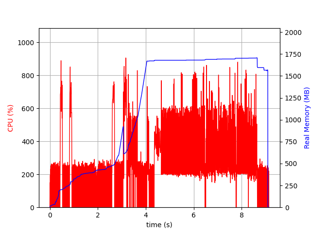
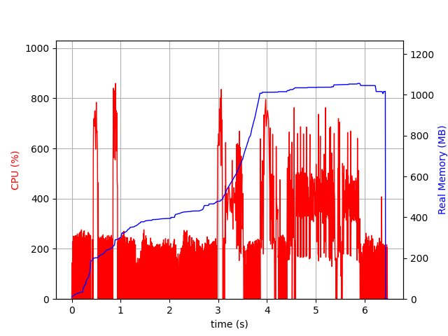
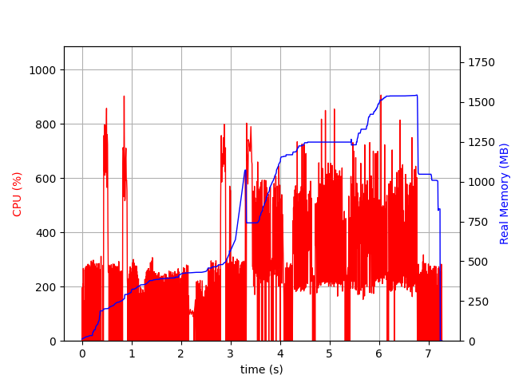
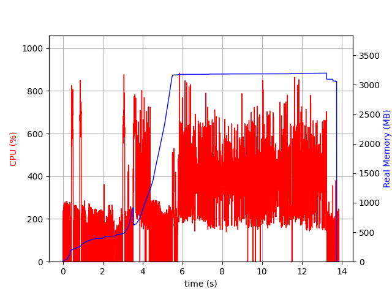

# Chatterbox

A command-line text-to-speech utility for UQs Software Architecture students to deploy as a scalable service.

## Installation

Chatterbox can be installed using pip:

```bash
pip install uq-chatterbox==0.1.0
```

## Usage

Once installed, the command line interface is available via the `chatterbox` command.

```bash
chatterbox --help
```

### Synthesizing Text

To synthesize text using the default model,
use the `--input-file` flag.

```bash
chatterbox run --input-file [filename]
```

This will output a randomly generated UUID to the `out/` directory, e.g. `out/4b52e28d9bb6c138.wav`.

The `--output-path` and `--run-id` can be used to have greater control over the output.

```bash
chatterbox run --input-file [filename] --output-path waves --run-id 001
```

Will create the output file in `waves/001.wav`.

### Downloading Models

Models will be downloaded automatically as required.
If you wish to pre-download the models, the `download` subcommand can be used.

```bash
chatterbox download --model tts_models/en/ek1/tacotron2
```

### Runtimes

These stats were made using:

```bash
psrecord "uq_chatterbox --input test.txt --model=" --log activity.txt
```

The input was the following:

```
My name is Evan Hughes, I have a bachelor of engineering in electrical and computer engineering from the univeristy of queensland and a bachelor of science from the university of queensland. I took five and a half years to complete my degree.
```

| Model | Stats |
| ----- | ----- |
| ek1/tacotron2 |  |
| ljspeech/tacotron2-DDC |  |
| ljspeech/tacotron2-DDC_ph |  |
| ljspeech/glow-tts |  |
| ljspeech/fast_pitch |  |
| sam/tacotron-DDC |  |